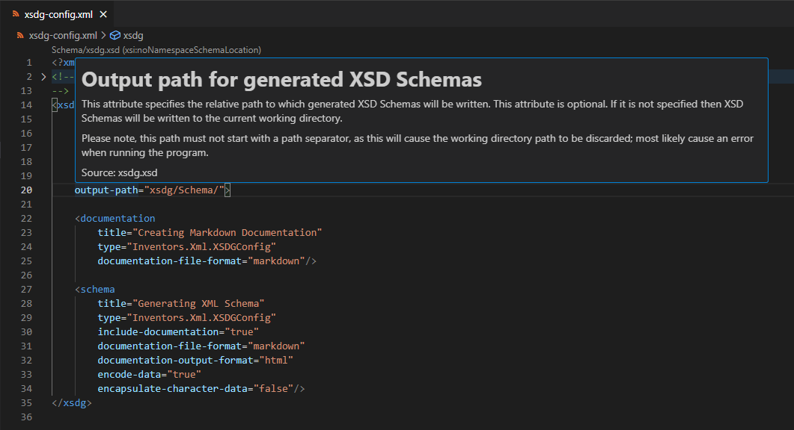
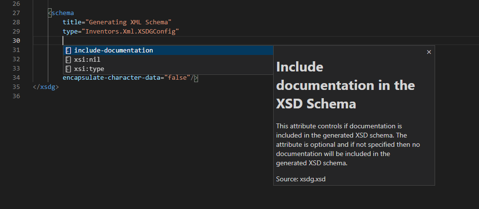

# Inventors.Xml

Inventors.Xml combines an optional library  (Inventors.Xml.Serialization) and a tool (xsdg.exe) to replace the venerable xsd.exe tool from Microsoft. While this tool is handy for automatically generating XSD schemas from C# classes, it suffers from several drawbacks:

1. It provides no feature for controlling whether an attribute or element is required,
2. It provides no feature for including doccumentation elements within the generated XSD Schema, and
3. It can only be used on the .NET Framework platform; no porting of the tool to .NET platform appears in the work.

These three drawbacks inspired us to write the Inventors.Xml.Serialization library and xsdg.exe tool. The tool is written to document the LabBench Language we are developing for describing neuroscience experiments, but its usefulness is not restricted to this particular XML-based language. Consequently, we have released the tool and library as open source (MIT), hoping others may benefit from our work. 

## Features

* Generation of XSD schemas from C# classes.
* Control of ```required``` for attributes and ```minOccurs``` for elements with an optional ```XmlRequiredAttribute``` from the Intentors.Xml.Serialization library.
* Useful extension methods for working with XML in the Inventors.Xml.Serialization library
* Generation of documentation annotations in the XSD schema from Text, Markdown, and HTML documentation files.
* Generation of a complete set of documentation files for a C# class hierarchy. 

## Usage

### xsdg.exe

The xsdg.exe can generate an XSD Schema for a C# class with the ```xsd``` command. Below is an example of generating an XSD Schema for the MockData class in the Serialization.Xml.Test library:

```
xsdg xsd -a Serialization.Xml.Test.dll 
```

With the doc command, the xsd.g.exe can generate empty stubs for documentation files for a C# class. Below is an example of how to generate stubs for the class MockData that was used in the previous example:

```
xsdg xsd -a Serialization.Xml.Test.dll 
```

### Inventors.Xml.Serialization

The System.Xml.Serialization namespace contains no Attribute that can control whether an attribute or element in the resulting XML schema is required—the Inventors.Xml.Serialization library provides a single attribute  (XmlRequiredAttribute) that can be used on properties to control whether the resulting attributes or elements will be marked as required in the generated XML Schema.

The use of this Attribute is optional, and the Inventors.Xml.Serialization library is not required for the xsdg.exe tool to be used on an assembly. If the XmlRequiredAttribute is not used, then xsdg will generate XSD Schemas with the same conventions as the xsd.exe tool.

Besides the XmlRequiredAttribute, the library also contains several extension functions that we find helpful when working with XML data.

## Documentation Files


### Benefits of documentation files 

#### Hover information



#### Code Completion



## LabBench Flavored XML
